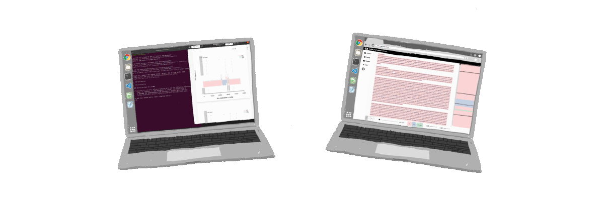
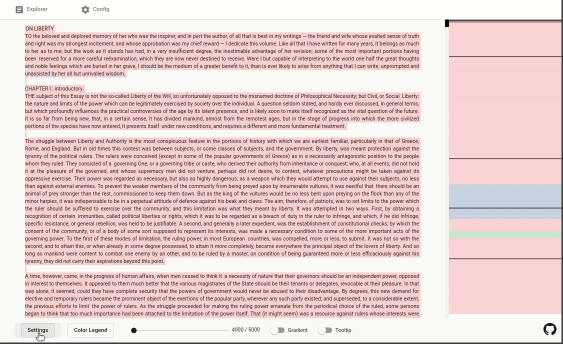

# Rolling Stylometry Explorer

The Rolling Stylometry Explorer is a web application to visualize rolling.classify results in the analyzed text. It was developed as a tool for use with the <a href="https://github.com/computationalstylistics/stylo">stylo R library</a> by the <a href="https://computationalstylistics.github.io/">Computational Stylistics Group</a>.
Take a look <a href="https://stylo-explorer.github.io/">here for the Live-Demo and the full documentation</a>.

   

 **Authors**: Jonas Osburg, Lilly Osburg </img>

##  Key Features </img>

- Display your rolling.classify results directly in the text
- Switch easily between different analyses and MFW values
- Use the Tooltip Feature to see the probabilities for each author
- Use the Gradient Feature and have the security of the authorship attribution displayed directly in the text
- Keep track of the configurations of the various analyses displayed in the Rolling Stylometry Explorer - transfer the configurations and have them displayed directly in the Explorer

##  How to use </img>

1. Download the Rolling Stylometry Explorer
2. Prepare your corpus
3. Move the `create_json_rolling.classify` into the folder containing the corpus. Paste your rolling.classify configuration into the `create_json_rolling.classify` file and execute it. It will perform the rolling.classify analysis you configured and generate a `classification.json` file with the results.
4. Execute the `json-consolidate.tx` file. Add the file path to the classification.json file(s). Follow the further instructions in the shell to provide information about the configurations, the analyzed text and possible authors. `json-consolidate` will then generate a `output.json` file.
5. Move the generated `output.json` file to `~/rolling-classify-visualizer/src/assets`
6. Implement the Rolling Sylometry Explorer on your website

If you want to integrate multiple analyses into the Rolling Stylometry Explorer, repeat steps 1-3 and then pass multiple file paths 

##  How it works </img>

Rolling.classify performs a windowing procedure and divides the text into short, overlapping sections. Rolling.classify then uses a machine learning algorithm to assign an author to each section. The Rolling Stylometry Explorer divides the text into the same sections as rolling.classify. The assignment made by rolling.classify is then made visible in the text by color highlighting. Each author is assigned a color. The most probable author for the corresponding text section is determined using the probabilities calculated by rolling.classify.

##  How to Contribute </img>
Just open a pull request :smile_cat:

##  How to Cite </img>
In case you want to cite us (we would appreciate it!)
(DOI goes here)

##  Credits & Acknowledgements </img>

- The Rolling Stylometry Explorer is designed as a helpful tool for interpreting results from <a href="https://github.com/computationalstylistics/stylo">the stylo R library</a> by the <a href="https://computationalstylistics.github.io/">Computational Stylistics Group</a>
- The ReadMe was inspired by the <a href="https://github.com/NSRare/NSGIF#readme">NSGIF ReadMe</a>
- Icons by <a href="https://material.io/resources/icons">Material Design</a>
- Thanks to our Beta-Tester <a href="https://www.philosophie.kit.edu/mitarbeiter_513.php">Christoph Schmidt-Petri</a>

##  Useful Links </img>

- <a href="https://computationalstylistics.github.io/resources/">Resources offered by the Computational Stylistcs Group</a> to start first rolling.classify analyses and try out stylo R and the Rolling Stylometry Explorer
- If you want to work with rolling.classify you should have a look at <a href="https://computationalstylistics.github.io/blog/rolling_stylometry/">this blog post</a> on Rolling Stylometry by Maciej Eder

##  License </img>

